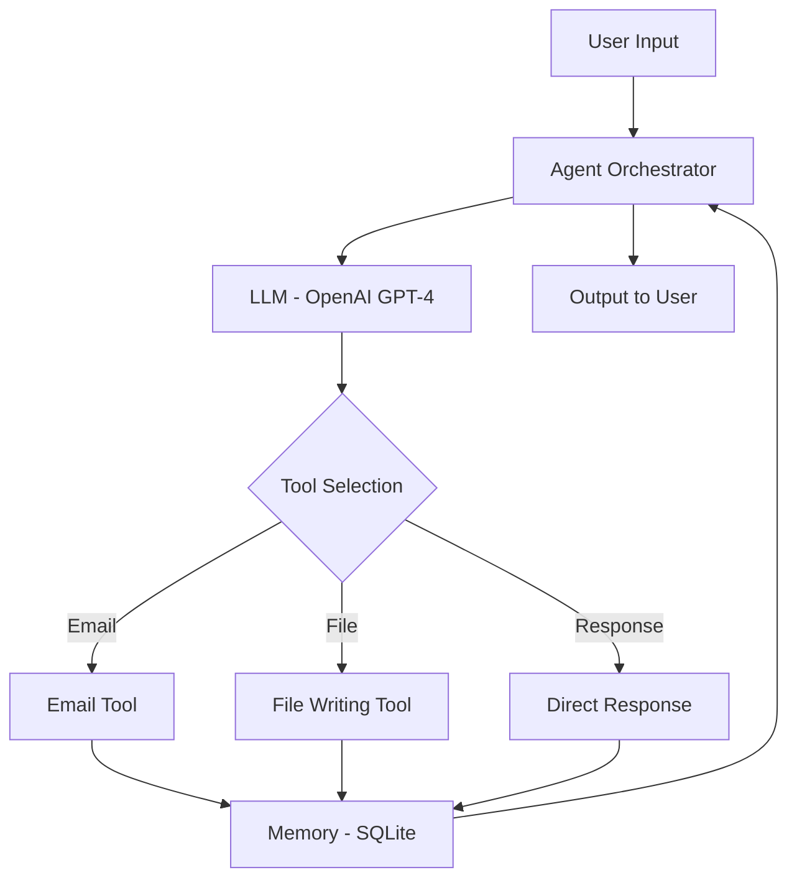

# AgenticAI - Implementation Plan

## Project Overview

Building an **Agentic AI system** with:
- **Agent Orchestrator**: Python-based agent that can think, plan, and execute
- **LLM**: OpenAI GPT-4 for reasoning and decision-making
- **Tools**: Email sending and file writing capabilities
- **Memory**: SQLite database for conversation history and context

## Architecture



## Technology Stack

- **Language**: Python 3.10+
- **LLM**: OpenAI GPT-4 with function calling
- **Database**: SQLite for memory
- **Email**: smtplib (built-in) or SendGrid
- **CLI**: Rich library for beautiful terminal UI

## Project Structure

```
AgenticAI/
├── agent/
│   ├── __init__.py
│   ├── orchestrator.py      # Main agent orchestrator
│   ├── llm.py               # OpenAI integration
│   └── prompts.py           # System prompts
├── tools/
│   ├── __init__.py
│   ├── base.py              # Base tool class
│   ├── email_tool.py        # Email sending tool
│   └── file_tool.py         # File writing tool
├── memory/
│   ├── __init__.py
│   ├── database.py          # SQLite operations
│   └── schema.sql           # Database schema
├── cli/
│   ├── __init__.py
│   └── interface.py         # CLI interface
├── main.py                  # Entry point
├── requirements.txt
├── .env.example
└── README.md
```

## Core Components

### 1. Agent Orchestrator

**Purpose**: Main control loop that coordinates LLM, tools, and memory

**Key Features**:
- Receives user input
- Sends context to LLM
- Parses LLM response for tool calls
- Executes tools
- Stores results in memory
- Returns formatted response

**Implementation**:
```python
class AgentOrchestrator:
    def __init__(self, llm, tools, memory):
        self.llm = llm
        self.tools = tools
        self.memory = memory
    
    def run(self, user_input):
        # 1. Retrieve relevant memory
        # 2. Build prompt with context
        # 3. Get LLM response
        # 4. Execute tools if needed
        # 5. Store in memory
        # 6. Return response
```

### 2. LLM Integration (OpenAI)

**Purpose**: Interface with OpenAI for reasoning and tool selection

**Key Features**:
- Function calling support
- Streaming responses
- Token management
- Error handling

**Tools Definition**:
```python
tools = [
    {
        "type": "function",
        "function": {
            "name": "send_email",
            "description": "Send an email to a recipient",
            "parameters": {
                "type": "object",
                "properties": {
                    "to": {"type": "string"},
                    "subject": {"type": "string"},
                    "body": {"type": "string"}
                },
                "required": ["to", "subject", "body"]
            }
        }
    },
    {
        "type": "function",
        "function": {
            "name": "write_file",
            "description": "Write content to a file",
            "parameters": {
                "type": "object",
                "properties": {
                    "filename": {"type": "string"},
                    "content": {"type": "string"}
                },
                "required": ["filename", "content"]
            }
        }
    }
]
```

### 3. Tools System

#### Email Tool
- Send emails via SMTP
- Support for HTML and plain text
- Attachment support (optional)
- Configuration via environment variables

#### File Writing Tool
- Write text files
- Create directories if needed
- Append or overwrite modes
- Safety checks (path validation)

**Base Tool Interface**:
```python
class BaseTool:
    name: str
    description: str
    
    def execute(self, **kwargs):
        raise NotImplementedError
```

### 4. Memory System (SQLite)

**Database Schema**:

```sql
-- Conversations table
CREATE TABLE conversations (
    id INTEGER PRIMARY KEY AUTOINCREMENT,
    session_id TEXT NOT NULL,
    timestamp DATETIME DEFAULT CURRENT_TIMESTAMP,
    role TEXT NOT NULL,  -- 'user', 'assistant', 'tool'
    content TEXT NOT NULL,
    metadata JSON
);

-- Tool executions table
CREATE TABLE tool_executions (
    id INTEGER PRIMARY KEY AUTOINCREMENT,
    conversation_id INTEGER,
    tool_name TEXT NOT NULL,
    parameters JSON NOT NULL,
    result TEXT,
    status TEXT,  -- 'success', 'error'
    timestamp DATETIME DEFAULT CURRENT_TIMESTAMP,
    FOREIGN KEY (conversation_id) REFERENCES conversations(id)
);

-- Sessions table
CREATE TABLE sessions (
    id TEXT PRIMARY KEY,
    created_at DATETIME DEFAULT CURRENT_TIMESTAMP,
    updated_at DATETIME DEFAULT CURRENT_TIMESTAMP,
    metadata JSON
);
```

**Memory Operations**:
- Store conversation messages
- Retrieve recent context
- Log tool executions
- Session management

## Implementation Steps

### Phase 1: Core Setup
1. Create project structure
2. Set up dependencies
3. Configure environment variables
4. Initialize SQLite database

### Phase 2: Tools Implementation
1. Create base tool class
2. Implement email tool
3. Implement file writing tool
4. Create tool registry

### Phase 3: LLM Integration
1. Set up OpenAI client
2. Define function schemas
3. Implement function calling
4. Add response parsing

### Phase 4: Agent Orchestrator
1. Build main agent loop
2. Integrate LLM
3. Connect tools
4. Add memory storage/retrieval

### Phase 5: CLI Interface
1. Create interactive CLI
2. Add command parsing
3. Implement help system
4. Add pretty output formatting

### Phase 6: Testing & Polish
1. Test all tools
2. Test agent reasoning
3. Add error handling
4. Write documentation

## Configuration

**Environment Variables** (`.env`):
```env
# OpenAI
OPENAI_API_KEY=sk-...

# Email (SMTP)
SMTP_HOST=smtp.gmail.com
SMTP_PORT=587
SMTP_USERNAME=your-email@gmail.com
SMTP_PASSWORD=your-app-password

# File System
FILES_OUTPUT_DIR=./output

# Database
DATABASE_PATH=./memory.db

# Agent Settings
MAX_ITERATIONS=10
TEMPERATURE=0.7
MODEL=gpt-4o
```

## Example Usage

```python
# Initialize agent
agent = AgentOrchestrator(
    llm=OpenAILLM(api_key=os.getenv("OPENAI_API_KEY")),
    tools=[EmailTool(), FileWritingTool()],
    memory=SQLiteMemory(db_path="memory.db")
)

# Run agent
response = agent.run("Send an email to john@example.com about the meeting tomorrow")

# Interactive mode
agent.interactive_mode()
```

## Success Criteria

✅ Agent can understand user requests  
✅ Agent correctly selects and uses tools  
✅ Email tool successfully sends emails  
✅ File tool creates files with correct content  
✅ Memory persists across sessions  
✅ Conversation history is retrievable  
✅ Clean CLI interface  
✅ Comprehensive error handling  

## Future Enhancements

- Add more tools (web search, API calls, etc.)
- Implement multi-step planning
- Add vector database for semantic memory
- Web UI interface
- Multi-agent collaboration
- Tool result validation
